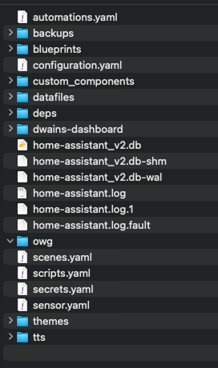
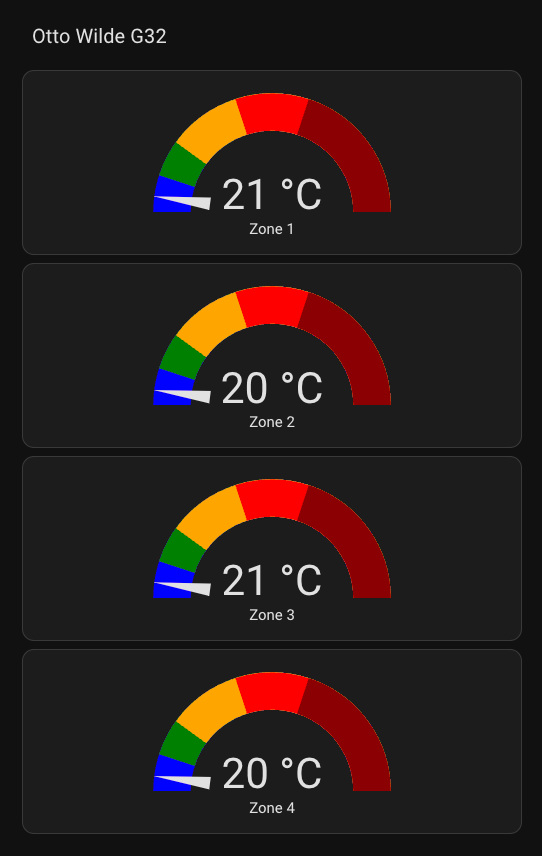

# How to integrate owg-data into Home-Assistant

## Target
The target of this integration is to have the temperatures from the Otto Wilde G32 
imported into HomeAssistant and displayed in a dashboard

## Getting Started
* You need to have access to the following configuration-files:
  * configuration.yaml
  * sensors.yaml (might not exist and needed to be created in the same folder than the configuration.yaml)

## allow access to the temperatures-file from your docker-container
* mount data-folder containing the temperatures-file of the owg to somewhere outside your docker-container
* make the folder accessible to the container or server that runs your home-assistant-instance
* add the folder to your allowlist, it should look something like this

```
homeassistant:
    allowlist_external_dirs:
        - /config/datafiles/
        - /share/owg/
```

* now add the following lines to your `sensors.yml`-file (or create it, if it does not exist)

```
- platform: file
  name: Grill Zone 1
  file_path: /share/owg/temperatures.csv
  value_template: '{{ value.split(";")[1] }}'
  unit_of_measurement: "°C"

- platform: file
  name: Grill Zone 2
  file_path: /share/owg/temperatures.csv
  value_template: '{{ value.split(";")[2] }}'
  unit_of_measurement: "°C"

- platform: file
  name: Grill Zone 3
  file_path: /share/owg/temperatures.csv
  value_template: '{{ value.split(";")[3] }}'
  unit_of_measurement: "°C"

- platform: file
  name: Grill Zone 4
  file_path: /share/owg/temperatures.csv
  value_template: '{{ value.split(";")[4] }}'
  unit_of_measurement: "°C"
```

* now go to the developer-tools of your home-assistant: `http://<ip>:8123/developer-tools/yaml` 
and click `CHECK CONFIGURATION`. If everything goes well, you can restart the whole Home-Assistant.

## Screenshots
### configuration folder contents

### Dashboard example
